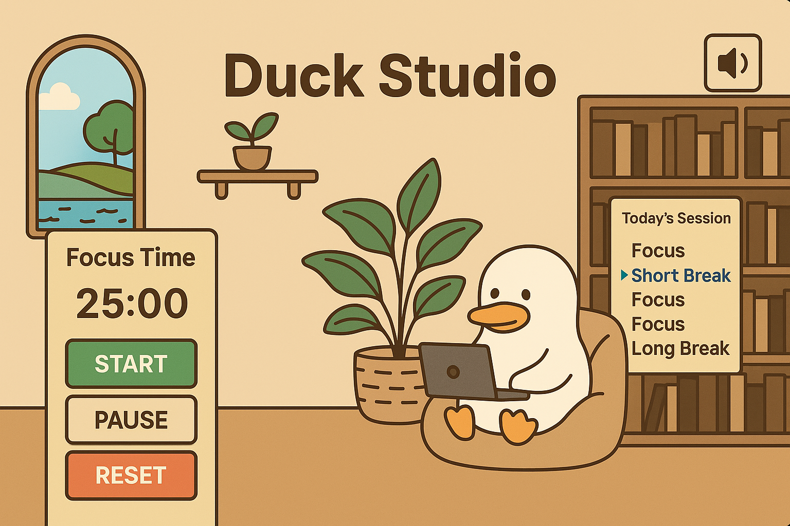

# 🦆 Duckmodoro

Duckmodoro is a cozy Pomodoro timer with ducks.  
Stay focused, take mindful breaks, and let your duck guide you through your day.

## 📸 Preview



---

## 🚀 Features

- ⏱ Classic Pomodoro cycle:
  - 25 min focus
  - 5 min short break
  - 15 min long break
- 🦆 A duck that changes posture depending on the current phase:
  - working, sipping coffee, relaxing
- 📋 Visual phase tracker with current phase indicator
- 🎵 Ambient sounds: birds chirping or garden wind
- 🌄 Illustrated cozy background scene
- 🔈 Mute/unmute sound with a single click

---

## 🛠 Tech Stack

- [Vue 3](https://vuejs.org/)
- Composition API
- [Quasar Framework (Vite)](https://quasar.dev/)
- [Pinia](https://pinia.vuejs.org/) — for global state
- Vite for ultra-fast development

---

## 📁 Project Structure

```plaintext
src/
├── assets/ # images, ducks, background, sounds
├── components/ # DuckTimer, DuckView, PhaseTracker, SoundToggle
├── layouts/ # MainLayout.vue
├── pages/ # IndexPage.vue
├── stores/ # timer.js
└── App.vue
```

---

## Getting Started

1. Install dependencies:

```bash
npm install
```

2. Run development server:

```bash
quasar dev
```

## Ideas for Future Features

- 🧠 Duck leveling system (progress tracking)
- 🎧 Sound picker (teapot, rain, pond)
- 📈 Focus stats per day/week
- 🐣 Tamagotchi-style duck mode

## 🤍 Author

Built with focus, caffeine, and a deep love for ducks.

## 📄 License

MIT — free to use and modify. Please keep the duck happy.
